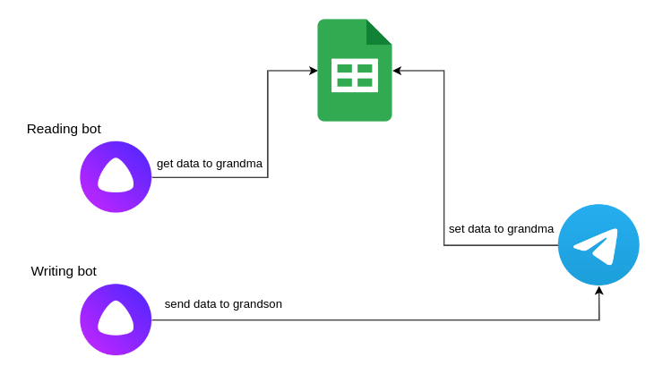

### Bot to chat with my old grandma.
It's a Yandex Alisa to Telegram bridge. The project based on [low code conversational platform](https://just-ai.com/en/platform). 
Using Yandex Alisa my grandma can ask Alisa to send me a message and Alisa'll send it to my telegram.  
Then I'll answer and that data will saved in google sheets.  
And my grandma have to reask Alisa to read message. Unfortunatlly Alisa can't notify her.

This bot splited on 3 bots.
1. `Telegram bot` receive messages directly from `Alisa bot` and save another messages to `Google sheets`.
2. first `Alisa bot` redirect or just `send messages` directly to `Telegram bot`
3. second `Alisa bot` read messages from `Google sheets`

Bot sources:
1. Telegram bot located in [telegram](./telegram) folder
2. Alisa bot to send messages to telegram located in [alisa-send](./alisa-send) folder
3. Alisa bot to read messages from Google sheets located in [alisa-read](./alisa-read) folder

